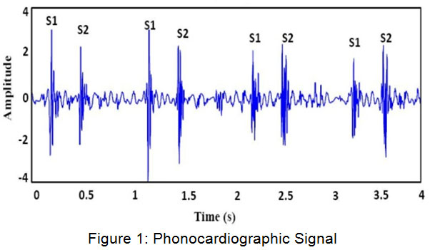

# Introduction 

This brief workshop introduces the phonocardiogram (PCG) as a practical biomedical engineering project for the acquisition and analysis of heart sounds. The project is motivated by the fact that cardiovascular diseases remain the leading cause of death globally, and there is a strong interest in accessible, low-cost technologies that support physiological monitoring, education, and early screening [^1]. In this context, the PCG is an attractive signal because it is non-invasive, low-cost, and directly related to the heart’s mechanical activity [^2]. 

The workshop is oriented toward the complete development of a basic PCG system, including signal sensing, analog conditioning, data acquisition, PCB design, fabrication, assembly, and testing. Rather than treating the topic solely from a theoretical perspective, the course uses the phonocardiogram as a project-based platform that integrates biomedical instrumentation, electronics design, and experimental validation. Open-source tools such as LTSpice and LibrePCB are integrated to support schematic capture and PCB design within a reproducible workflow [^4].

# The Phonocardiogram

A phonocardiogram is the recorded representation of heart sounds obtained during auscultation[^2]. The main normal sounds are S1 and S2, which correspond to valve-closure events during the cardiac cycle [^2]. Since these sounds reflect relevant physiological and mechanical events, PCG recordings provide a useful means to study cardiac timing, rhythm, and abnormal acoustic patterns. In digital form, the signal can be stored, visualized, processed, and used for further training or research [^3].

Educationally, the PCG is especially useful because it allows students to connect physiological concepts with real instrumentation tasks. It also supports visual learning, and published work has shown that phonocardiographic support can improve heart sound identification in novice learners [^5]. For that reason, the PCG is a suitable case study for introducing biomedical signals through a hands-on engineering project.

# References

[^1]: World Health Organization, *Cardiovascular diseases*, https://www.who.int/health-topics/cardiovascular-diseases (accessed April 7, 2026).

[^2]: StatPearls, *Physiology, Cardiovascular Murmurs*, National Center for Biotechnology Information, https://www.ncbi.nlm.nih.gov/books/NBK541010/ (accessed April 7, 2026).

[^3]: Article on digital phonocardiography and heart sound analysis, PubMed Central, https://pmc.ncbi.nlm.nih.gov/articles/PMC7374414/ (accessed April 7, 2026).

[^4]: LibrePCB, *LibrePCB – Professional EDA Made Simple*, https://librepcb.org/ (accessed April 7, 2026).

[^5]: Educational study on phonocardiographic support for heart sound learning, PubMed Central, https://pmc.ncbi.nlm.nih.gov/articles/PMC8187497/ (accessed April 7, 2026).