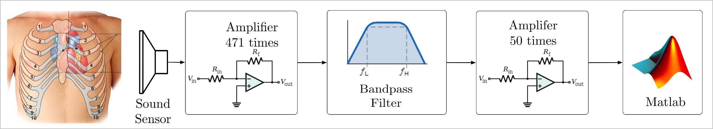
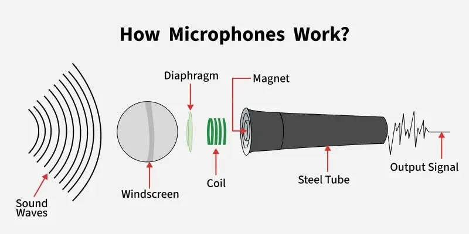
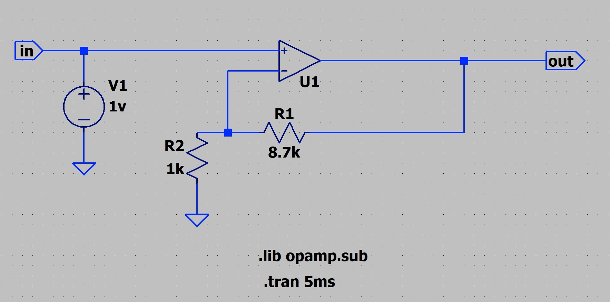
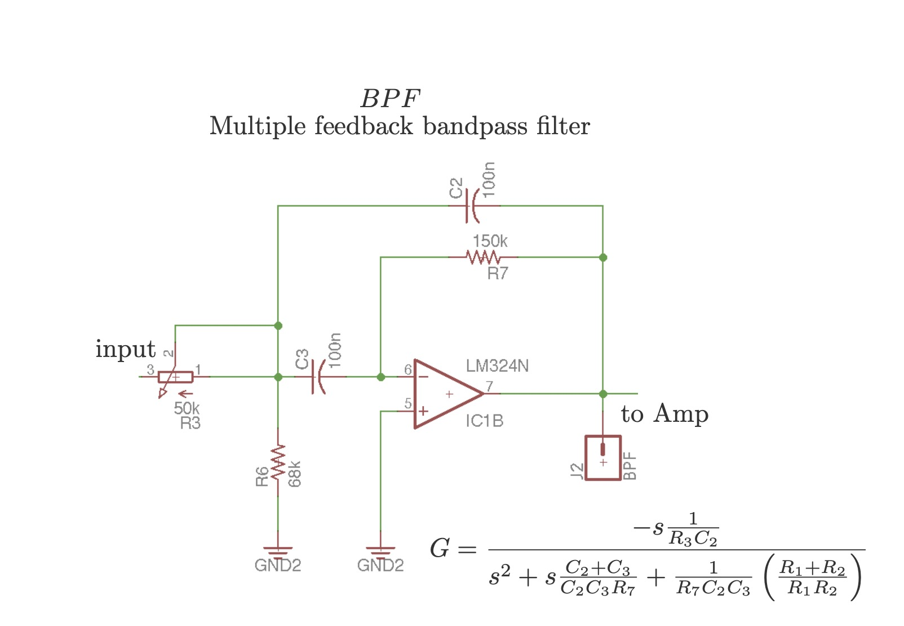

# Introduction 

One of the most important stages during circuit design is simulation. Several circuit simulators are available to carry out the task, but **SPICE-based** simulators are the most versatile and powerful.

SPICE stands for **Simulation Program with Integrated Circuit Emphasis**. It is a general-purpose, open-source analog electronic circuit simulator originally developed at the University of California, Berkeley, in the 1970s. SPICE is now the foundation for almost all modern circuit simulators (LTspice, PSpice, HSPICE, Ngspice, among others).

# The basic PCG Scheme

A basic phonocardiogram system can be understood as a sequence of functional blocks that transform weak acoustic heart sounds into a signal suitable for digital processing and visualization.




The proposed scheme includes the following stages:

1. **Acoustic sensing**
2. **First amplification stage**
3. **Band-pass filtering**
4. **Second amplification stage**
5. **Digital visualization and analysis**

## Acoustic sensing

The first block is the **sound sensor**, which detects the mechanical vibrations produced by cardiac activity. In a basic PCG prototype, this element is commonly implemented with a microphone, an electret capsule, or another acoustic transducer coupled to the chest through a stethoscope-like structure.



The signal obtained at this stage is usually very small, often in the order of **millivolts**, and may also contain unwanted components due to ambient noise, friction, breathing, and body motion. For this reason, the sensor output cannot be used directly and must be conditioned by analog circuitry.

## First amplification stage

The first amplifier increases the amplitude of the weak sensor signal while preserving the waveform as much as possible. This initial gain stage is important because the raw PCG signal is typically too small for direct filtering and processing.

In the general scheme shown above, the first amplifier provides a gain of approximately **471 times**. Such a high gain must be designed carefully because excessive amplification at the input may also increase noise and saturate the circuit if large disturbances are present.

This stage is often implemented with an operational amplifier configured in **non-inverting mode**, since this topology offers:

- high input impedance,
- simple gain adjustment,
- stable operation under negative feedback.

## Band-pass filtering

After the first amplification, the signal is passed through a **band-pass filter**. The purpose of this block is to preserve the frequency components associated with heart sounds while attenuating unwanted low-frequency and high-frequency components.

In a basic PCG system, the band-pass filter helps reduce:

- baseline fluctuations and motion artifacts at low frequencies,
- environmental and electronic noise at high frequencies.

This stage is fundamental because the useful PCG information is concentrated in a limited frequency range. Therefore, the filter improves the signal-to-noise ratio before the final amplification and digital analysis.

## Second amplification stage

Once the useful band has been isolated, a second amplification stage is used to increase the signal to a more convenient level for acquisition or visualization. In the scheme, this stage provides a gain of approximately **50 times**.

Separating the total gain into two stages is usually preferable to using a single very large-gain stage, because it improves stability and allows filtering to be inserted between amplification blocks. In practice, this reduces the risk of saturating the output with unwanted frequency components.

## Digital visualization and analysis

Finally, the conditioned signal can be exported to a digital environment such as **MATLAB** for visualization and analysis. At this stage, it is possible to:

- observe the waveform in the time domain,
- identify the main heart sounds $S_1$ and $S_2$,
- estimate amplitudes and durations,
- perform additional digital filtering,
- compute spectral or time-frequency representations.

This final step connects the analog instrumentation stage with signal processing and interpretation.

# Non-Inverting Amplifier

A non-inverting amplifier is one of the most common operational amplifier configurations for sensor conditioning. In this topology, the input signal is applied to the **non-inverting terminal**, while a resistive network connected between the output and the inverting terminal provides **negative feedback**.

This configuration is suitable for PCG front-end design because it does not place a heavy load on the sensor and allows straightforward gain selection.

## Operating principle


For an **ideal operational amplifier** operating with negative feedback:

- the input currents are approximately zero,
- the voltage at the inverting terminal $(-)$ is approximately equal to the voltage at the non-inverting terminal $(+)$.

Thus, in the diagram shown above,

$V^- \approx V^+ = V_{in}$

and the closed-loop gain is determined by the feedback resistors $R_f$ and $R_g$.

## Design equations

For the standard non-inverting amplifier:

$A_v = \frac{V_{out}}{V_{in}} = 1 + \frac{R_f}{R_g}$

where:

- $R_f$ is the feedback resistor,
- $R_g$ is the resistor connected from the inverting input to ground.

Therefore, the output voltage is:

$V_{out} = \left(1 + \frac{R_f}{R_g}\right)V_{in}$

### Example

Using:


$R_f = 8.7\,k\Omega,\qquad R_g = 1\,k\Omega$

The gain is:


$A_v = 1 + \frac{8.7\,k\Omega}{1\,k\Omega} = 9.7$

Thus, the circuit amplifies the input signal by approximately **9.7 times**.

### Pre-amplification stage example

If a gain near 470 is required, then the resistor ratio should satisfy:


$1 + \frac{R_f}{R_g} \approx 471$

which implies:

$\frac{R_f}{R_g} \approx 470$

For example, if:

$R_g = 1\,k\Omega$

then a possible value is:

$R_f \approx 470\,k\Omega$

## Non-Inverting amplifier simulation - GUI
The circuit can first be assembled in the simulator interface to verify connectivity, polarity, and expected behavior.



## Simulation with Spice code

```spice
* Non-inverting
Vin vp 0 1v ; DC input ; SINE(0,1v,1k)
R1  vn out 8.7k
R2  vn 0  1k
R4  out 0 100k

.lib opamp.sub
*   vn vp out model parameters
XU1 vn vp out opamp Aol=100k GBW=10Meg

.tran 0 5ms 0.1us
.end
```


# Band-Pass Filter Design

After the first amplification stage, the signal is applied to an active **band-pass filter**.  
The purpose of this block is to preserve the frequency components associated with the main heart sounds while attenuating low-frequency baseline variations and high-frequency noise. In a basic phonocardiogram (PCG) front-end, this stage is essential because the acoustic signal acquired from the sensor still contains environmental interference, motion artifacts, and undesired spectral components.

The implemented topology is a **multiple-feedback band-pass filter (MFB BPF)** using an LM324 operational amplifier. This configuration is appropriate for low-frequency biomedical instrumentation because it provides band-pass behavior with a reduced number of components and allows the center frequency and quality factor to be adjusted directly.

## Filter topology



The circuit is based on two capacitors and three resistive elements around the operational amplifier. In the practical implementation, the filter output is connected to the next amplification stage. A variable resistor is also included to facilitate adjustment during tuning.

The multiple-feedback band-pass filter implemented in this work uses the component labels shown in the practical schematic: $R_3$, $R_6$, $R_7$, $C_2$, and $C_3$. Therefore, the transfer function is written as

$$G(s)=\frac{-\dfrac{s}{R_3C_2}}{s^2+s\left(\dfrac{C_2+C_3}{R_7C_2C_3}\right)+\dfrac{R_3+R_6}{R_3R_6R_7C_2C_3}}$$

This expression corresponds to a second-order active band-pass filter. The negative sign indicates inversion, which is characteristic of the multiple-feedback topology.

This expression shows that the circuit behaves as a **second-order active band-pass filter**, where:

- the numerator contains the term in $s$ that characterizes the band-pass response,
- the denominator determines the center frequency and damping,
- the resistor and capacitor values define the bandwidth and selectivity.

## Design objective

The filter was adjusted to emphasize the low-frequency content of the heart sound signal. The selected design parameters were:

$$Q = 2$$

$$f_0 = 33 \text{ Hz}$$

$$C_2 = C_3 = 100 \text{ nF}$$

$$H = 2$$

where:

- $f_0$ is the center frequency,
- $Q$ is the quality factor,
- $H$ is the gain factor used in the design equations,
- $C_2$ and $C_3$ are the filter capacitors.

These values were selected as an initial tuning point for the analog conditioning of the PCG signal.

## Design equations

For the selected multiple-feedback band-pass filter, the initial design was defined by the following relationships:

$$k = 2 \pi f_0 C_3$$

$$C_2 = C_3$$

$$R_3 = \frac{1}{Hk}$$

$$R_6 = \frac{1}{(2Q - H)k}$$

$$R_7 = \frac{2Q}{k}$$

These equations provide nominal component values for the multiple-feedback band-pass filter once the target center frequency $f_0$, quality factor $Q$, gain factor $H$, and capacitor values are fixed.

It should be noted that these expressions correspond to the synthesis procedure adopted for the filter design, while the practical schematic uses the component labels $R_3$, $R_6$, $R_7$, $C_2$, and $C_3$.

## Component calculation

Using:

$f_0 = 33 \text{ Hz}$

$C_3 = 100 \text{ nF} = 100 \times 10^{-9} \text{ F}$

the parameter $k$ is:

$k = 2 \pi (33)(100 \times 10^{-9})$

$k \approx 2.07 \times 10^{-5}$

Then, for $H = 2$ and $Q = 2$:

### Calculation of $R_3$

$$R_3 = \frac{1}{Hk} = \frac{1}{2(2.07 \times 10^{-5})}$$


$R_3 \approx 24.1 \text{ k}\Omega$

### Calculation of $R_6$


$R_6 = \frac{1}{(2Q-H)k}$

Since:

$2Q - H = 2(2) - 2 = 2$

then:

$R_6 = \frac{1}{2(2.07 \times 10^{-5})}$

$R_6 \approx 24.1 \text{ k}\Omega$

### Calculation of $R_7$

$R_5 = \frac{2Q}{k} = \frac{4}{2.07 \times 10^{-5}}$

$R_5 \approx 193 \text{ k}\Omega$

Therefore, the theoretical component values obtained from the design equations are approximately:

$R_3 \approx 24.1 \text{ k}\Omega$

$R_6 \approx 24.1 \text{ k}\Omega$

$R_7 \approx 193 \text{ k}\Omega$

## Practical implementation

In the practical circuit, the filter was implemented with the following values:

- variable resistor at the input: **50 k\Omega**
- resistor to ground: **68 k\Omega**
- feedback resistor: **150 k\Omega**
- capacitors: **100 nF**

These values do not exactly match the theoretical estimates. This is acceptable in an experimental prototype because the final design is commonly adjusted according to:

- commercial component availability,
- simulator response,
- desired attenuation and gain,
- interaction with the previous and next stages,
- real behavior of the LM324 at low frequencies.

In particular, the use of a **50 k\Omega potentiometer** allows the filter input resistance to be tuned experimentally. This is useful when the prototype is intended for teaching, laboratory testing, or early-stage validation rather than strict precision synthesis.


## Design interpretation

The selected center frequency of approximately $33 \text{ Hz}$ places the filter in the low-frequency region, which is relevant for the main mechanical components of the heart sound signal. The value $Q = 2$ gives a moderate selectivity, allowing the filter to emphasize the target band without making the response excessively narrow.

From a practical perspective, this filter stage serves three purposes:

1. it limits the bandwidth before the next amplifier,
2. it suppresses unwanted frequency components outside the region of interest,
3. it improves the overall signal conditioning chain before digital acquisition or MATLAB processing.

