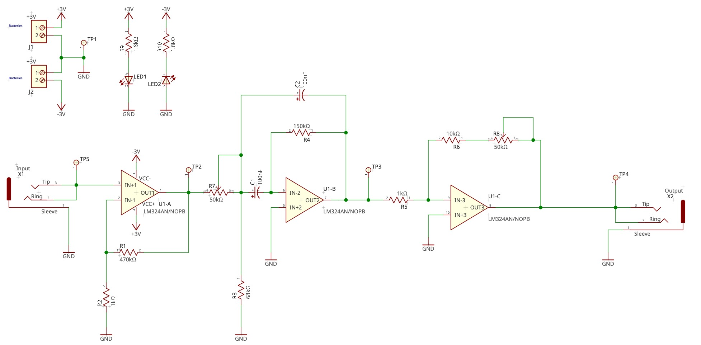
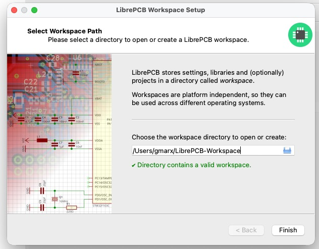
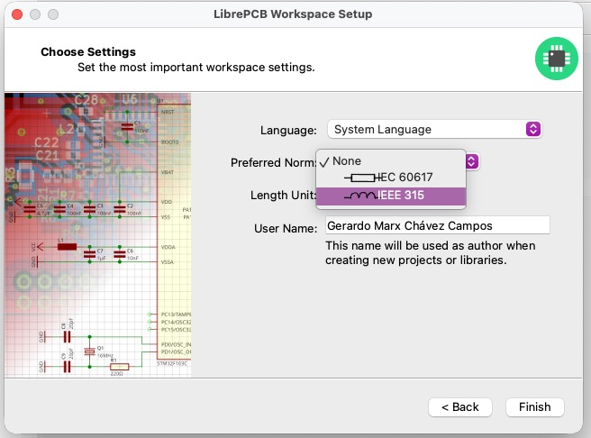
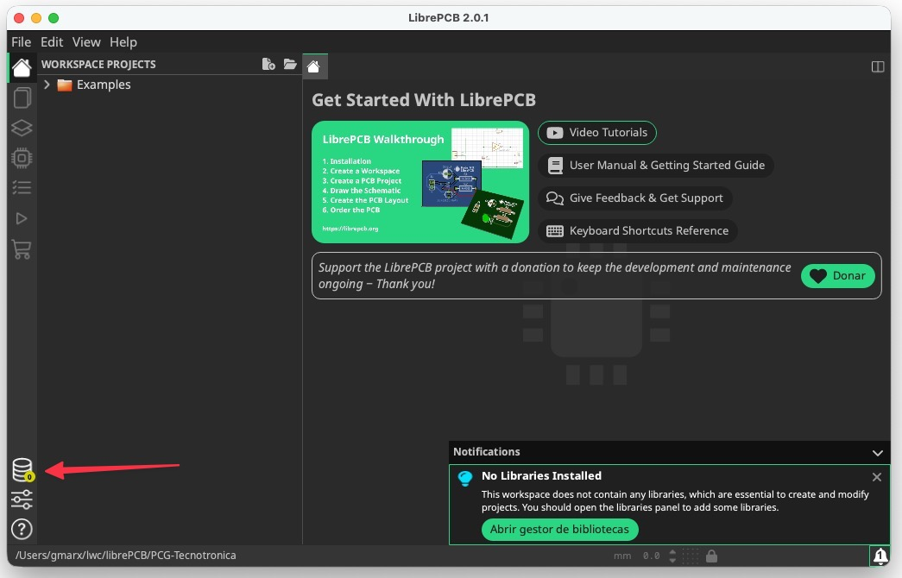
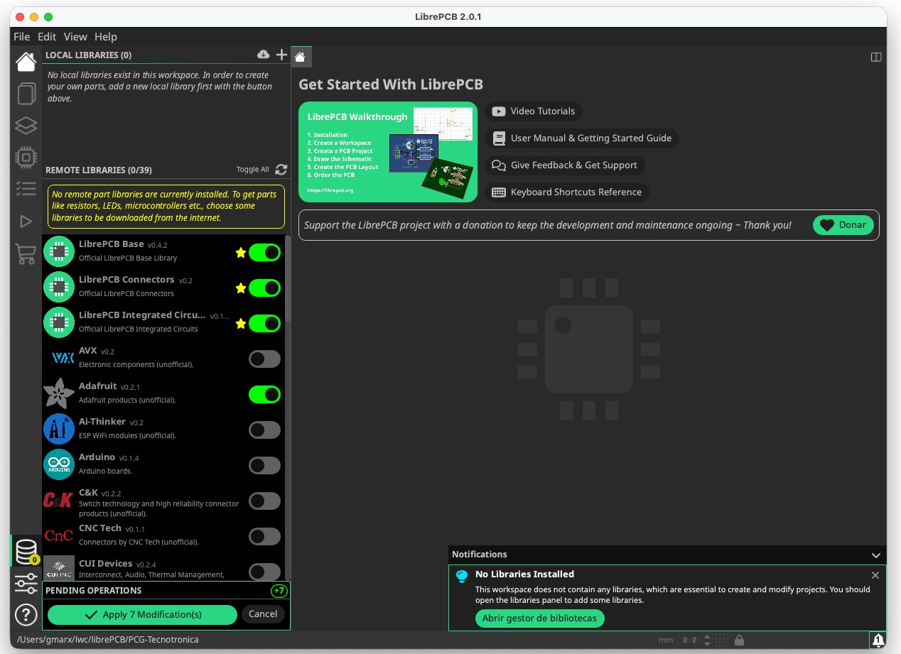

# Introduction
The following tutorial is based on the official software documentation; [available here](https://librepcb.org/docs/quickstart/). Then, this tutorial is a quick-start guide to using LibrePCB as we build our PCG project.
 
# The complete design
The complete design and its component values are shown next.

# Quick-Start to LibrePCB

## The workspace

When starting LibrePCB for the first time, a wizard will ask you to open or create a workspace. The workspace is just a directory where settings, libraries, and —optionally— projects will be stored. Once created, it can be used on all supported operating systems (i.e., it is platform-independent) and with any LibrePCB version. Thus, you can create a workspace for groups of projects, company-specific settings, or university lectures. Later, you can switch between workspaces.

You can just accept the default workspace location (you could still move it to another location afterward, if desired):

**Note: If the selected path does not contain a workspace yet, clicking on Next will show a page to choose the most important settings:**

It is recommended to select at least your preferred norm and length unit since these usually depend on where you’re living.

**Note: You can change these settings at any time later in the main window under File  Workspace Settings.**

## Libraries

Before you can start creating new projects, you need to add some libraries to your workspace. Libraries contain various kinds of elements that can be added to schematics and boards (e.g., symbols, footprints, and devices).

Click on `Libraries` in the sidebar:

LibrePCB then immediately fetches the list of available libraries from the Internet. Most of these libraries are hosted at [github.com/LibrePCB-Libraries](github.com/LibrePCB-Libraries).

Then you can select the libraries you like to install. The most important library is *LibrePCB Base*, which contains commonly used elements such as resistors and diodes. It is highly recommended to install at least this library.

Click on the Apply button to finish the installation.

Later, you can keep the installed libraries up to date the same way — once you open the libraries panel, all outdated libraries will automatically be marked for update, and you only need to click on the Apply button.

## Create a local library and elements

This section will be developed later.

## Modifying a local library

3.5mm Jack Audio
Mfr. Part #
[Datasheet SJ3-35063B](./sj3_3506x.pdf)

## Creating a project
- Create a new project
- Add components
- Add a local library with all symbols, devices, and components
- Wire schematic
- Route the layout
- Mill or build the PCB
- Soldering

